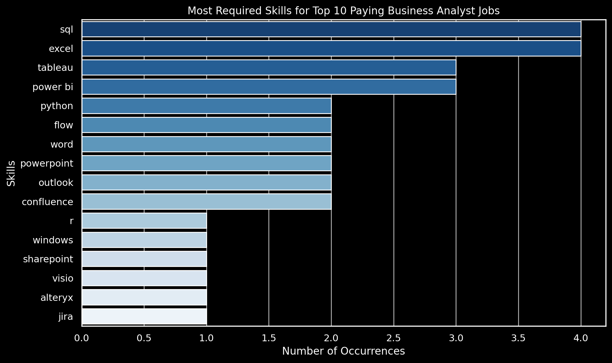

# Introduction

**📊 Exploring the Business Analyst Job Market:**  

This project dives into the business analyst job market, aiming to uncover 💼 top-paying jobs, 🔧 essential skills, and where high demand meets salary growth 📈. By analyzing job data, this project provides insights for anyone looking to navigate the business analyst career path and focus their professional development.

🔍 **Curious about the SQL queries?** Check them out here: [project_sql folder](/project_sql/)

# Background

In today's rapidly evolving job market, the role of a business analyst has become pivotal for driving data-driven decisions within organizations. This project was developed to better understand which factors influence success in this field. By analyzing data on salaries, job postings, and required skills, the goal is to highlight the most valuable insights for aspiring business analysts. Whether you're entering the field or aiming to grow within it, this project is designed to reveal key trends in demand, salary potential, and skill optimization.

The dataset for this analysis is sourced from Luke Barousse's [SQL Course](https://lukebarousse.com/sql), which provides comprehensive insights into job titles, salaries, locations, and essential skills for various data-related roles.

The key questions I sought to answer through my SQL queries are:

1. What are the top-paying business analyst jobs?
2. What skills are required for these top-paying jobs?
3. What skills are most in demand for business analysts?
4. Which skills are associated with higher salaries?
5. What are the most optimal skills to learn?

# Tools I Used

For this project, I relied on a range of tools to extract insights from the business analyst job market data. Each tool played a crucial role in transforming raw data into actionable insights:

- **SQL:** Central to the analysis, SQL was used to explore the dataset, run queries, and extract the key information needed to answer my questions about business analyst roles.
- **PostgreSQL:** The database management system chosen to store and manage the job posting data efficiently.
- **Visual Studio Code:** This was my development environment for writing, testing, and fine-tuning SQL queries, as well as managing and organizing the project files.
- **Git & GitHub:** Crucial for version control, collaboration, and sharing the project with others. GitHub enabled easy access to all code and analysis, making the project publicly available for review and contributions.

# The Analysis

Each SQL query in this project was crafted to dig into specific trends in the business analyst job market. From salary insights to the most valuable skills, here's how I approached answering each question:

---

## 1. Top-Paying Business Analyst Jobs

To identify the highest-paying roles, I filtered business analyst positions by average yearly salary and focused on remote opportunities. This query highlights the top-paying business analyst jobs currently available.
 
```sql
SELECT
    job_id,
    job_title,
    job_location,
    job_schedule_type,
    salary_year_avg,
    job_posted_date,
    name AS company_name
FROM
    job_postings_fact
LEFT JOIN company_dim ON job_postings_fact.company_id = company_dim.company_id
WHERE
    job_title LIKE '%Business Analyst%'
    AND salary_year_avg IS NOT NULL
    AND job_location = 'Anywhere'
ORDER BY
    salary_year_avg DESC 
LIMIT 10;
```
**Results Breakdown:**

- **Salary Range:** The top 10 highest-paying business analyst roles range from $90,000 to $100,000 annually.
- **Job Titles:** High-paying titles like “Business Analyst - Data Quality” and “Staff Business Analyst - Finance” stand out, with a few entry-level positions also offering competitive salaries.
- **Industries:** Top-paying roles span various industries such as technology, finance, and data management.


*Bar graph visualizing the salary for the top 10 salaries for business analysts; ChatGPT generated this graph from my SQL query results*

**Analysis:**

The results show that there’s significant salary potential even for entry-level business analyst roles, particularly those with a specialized focus such as data quality or finance. Employers in the tech and finance sectors offer remote flexibility and high salaries, making these positions attractive. Pursuing expertise in fields like finance or data quality may unlock higher salary opportunities in business analysis.

## 2. Skills for Top-Paying Business Analyst Jobs

To identify the skills required for the highest-paying business analyst roles, I joined the job postings with their associated skill data. This query highlights the key skills that employers value for roles with the highest salaries.

```sql
WITH top_paying_jobs AS (
    SELECT
        job_id,
        job_title,
        salary_year_avg,
        name AS company_name
    FROM
        job_postings_fact
    LEFT JOIN company_dim ON job_postings_fact.company_id = company_dim.company_id
    WHERE
        job_title LIKE '%Business Analyst%'
        AND salary_year_avg IS NOT NULL
        AND job_location = 'Anywhere'
    ORDER BY
        salary_year_avg DESC
    LIMIT 10
)
SELECT
    top_paying_jobs.job_id,
    job_title,
    salary_year_avg,
    skills
FROM
    top_paying_jobs
    INNER JOIN
    skills_job_dim ON top_paying_jobs.job_id = skills_job_dim.job_id
    INNER JOIN
    skills_dim ON skills_job_dim.skill_id = skills_dim.skill_id
ORDER BY
    salary_year_avg DESC;
```

**Results Breakdown:**

- **SQL** and **Excel**  each have a count of 4, reflecting their strong relevance in data manipulation, reporting, and business operations.
- **Python**, **Tableau**, and **PowerBI** each have a count of 3, demonstrating their importance for advanced analysis, data visualization, and decision-making.
- •	Tools such as **Flow**, **PowerPoint**, **Confluence**, **Word**, and **Outlook** are each counted twice, highlighting their utility in business communication and process automation.


*Bar graph visualizing the count of skills for the top 10 paying jobs for business analysts; ChatGPT generated this graph from my SQL query results*

**Analysis:**

SQL and Excel still dominate, being core skills for business analyst roles, especially in data processing and reporting. Python, Tableau, and Power BI are crucial for advanced analysis and data visualization, which are increasingly in demand. Additionally, Flow, Confluence, and PowerPoint demonstrate the growing need for process automation and effective communication in business analysis roles.

## 3. In-Demand Skills for Business Analysts

To identify the most in-demand skills for business analysts, I analyzed remote job postings and counted the occurrences of each skill. This query reveals which skills are currently most sought after by employers.

```sql
SELECT
    skills_dim.skills,
    COUNT(skills_job_dim.job_id) AS demand_count
FROM
    job_postings_fact
INNER JOIN
    skills_job_dim ON job_postings_fact.job_id = skills_job_dim.job_id
INNER JOIN
    skills_dim ON skills_job_dim.skill_id = skills_dim.skill_id
WHERE
    job_postings_fact.job_title_short = 'Business Analyst'
    AND job_work_from_home = True
GROUP BY
    skills_dim.skills
ORDER BY
    demand_count DESC
LIMIT 5;
```

**Results Breakdown:**

- **SQL** and **Excel** are the most commonly requested skills, reflecting their necessity for fundamental data processing and analysis tasks in business analysis.
- **Python** is in high demand due to its capabilities in automation and handling complex data manipulations, showcasing its growing relevance in the field.
- **Tableau** and **Power BI** are widely sought after, emphasizing the need for data visualization and business intelligence tools that support decision-making.

| Skills    | Demand Count |
|-----------|--------------|
| SQL       | 7,291        |
| Excel     | 4,611        |
| Python    | 4,330        |
| Tableau   | 3,745        |
| Power BI  | 2,609        |

*Table of the demand for the top 5 skills in business analyst job postings*

**Analysis:**

SQL and Excel remain foundational tools in the business analyst toolkit, as they are essential for managing, analyzing, and reporting data. However, with the growing reliance on data-driven insights, skills like Python, Tableau, and Power BI are becoming increasingly important. Python’s ability to automate workflows and perform complex data analysis makes it a valuable skill, while Tableau and Power BI are crucial for translating raw data into meaningful visualizations that guide strategic decisions.

## 4. Skills Based on Salary

To explore which skills are associated with the highest salaries, I analyzed the average salary for job postings that listed specific skills. This query highlights the top-paying skills for business analysts.

```sql
SELECT
    skills_dim.skills AS skill, 
    ROUND(AVG(job_postings_fact.salary_year_avg),2) AS avg_salary
FROM
    job_postings_fact
INNER JOIN
    skills_job_dim ON job_postings_fact.job_id = skills_job_dim.job_id
INNER JOIN
    skills_dim ON skills_job_dim.skill_id = skills_dim.skill_id
WHERE
    job_postings_fact.job_title_short = 'Business Analyst' 
    AND job_postings_fact.salary_year_avg IS NOT NULL 
    AND job_work_from_home = True  
GROUP BY
    skills_dim.skills 
ORDER BY
    avg_salary DESC
LIMIT 10;
```
**Results Breakdown:**

- **Chef** stands out as the highest-paying skill, with an average salary of $220,000, reflecting its high demand in automation and large-scale applications.
- **Phoenix** and **Looker** follow closely behind, with average salaries of $135,990 and $130,400, indicating the premium placed on tools that support analytics and web applications.
- Traditional tools like **MongoDB** and **Python** continue to command competitive salaries, reflecting their importance in data management and advanced data analysis.
- **GCP** and **BigQuery** are notable for their strong salary potential, underscoring the demand for cloud-based data management solutions.

| Skills        | Average Salary ($) |
|---------------|-------------------:|
| Chef          | 220,000            |
| Phoenix       | 135,990            |
| Looker        | 130,400            |
| MongoDB       | 120,000            |
| Python        | 116,516            |
| BigQuery      | 115,833            |
| GCP           | 115,833            |
| R             | 114,629            |
| DB2           | 114,500            |
| Snowflake     | 114,500            |

*Table of the average salary for the top 10 paying skills for business analysts*


**Analysis:**

The data shows that specialized tools and frameworks such as Chef, Phoenix, and Looker are associated with higher salaries, reflecting their value in automation, data management, and web development. Python remains a versatile and highly sought-after skill, particularly for its applications in advanced data analysis and automation. Cloud-based tools like GCP and BigQuery are also proving to be highly valuable in the evolving landscape of business analysis, as more companies shift toward cloud solutions for managing and analyzing large datasets.

## 5. Most Optimal Skills to Learn

To identify the most optimal skills for business analysts, I combined the demand and salary data to highlight skills that offer both high demand and competitive salaries. This query aims to reveal which skills are the most strategic to learn.

**SQL Query Example:**

```sql
WITH skills_demand AS (
    SELECT
        skills_dim.skill_id,
        skills_dim.skills,
        COUNT(skills_job_dim.job_id) AS demand_count
    FROM
        job_postings_fact
    INNER JOIN
        skills_job_dim ON job_postings_fact.job_id = skills_job_dim.job_id
    INNER JOIN
        skills_dim ON skills_job_dim.skill_id = skills_dim.skill_id
    WHERE
        job_postings_fact.job_title_short = 'Business Analyst'
        AND job_postings_fact.salary_year_avg IS NOT NULL
        AND job_postings_fact.job_work_from_home = True
    GROUP BY
        skills_dim.skill_id
),
average_salary AS (
    SELECT
        skills_job_dim.skill_id,
        AVG(job_postings_fact.salary_year_avg) AS avg_salary
    FROM
        job_postings_fact
    INNER JOIN
        skills_job_dim ON job_postings_fact.job_id = skills_job_dim.job_id
    WHERE
        job_postings_fact.job_title_short = 'Business Analyst'
        AND job_postings_fact.salary_year_avg IS NOT NULL
        AND job_postings_fact.job_work_from_home = True
    GROUP BY
        skills_job_dim.skill_id
) 
SELECT
    skills_demand.skills,
    skills_demand.demand_count,
    ROUND(average_salary.avg_salary, 2) AS avg_salary
FROM
    skills_demand
INNER JOIN
    average_salary ON skills_demand.skill_id = average_salary.skill_id
WHERE demand_count > 10
ORDER BY
    demand_count DESC, 
    avg_salary DESC
LIMIT 25;
```
**Results Breakdown:**

- **SQL** and **Python** stand out as the most optimal skills to learn, offering both high demand and competitive salaries.
- **Excel** and **Tableau** are highly sought after and are valuable for presenting and analyzing data effectively.
- **Power BI** also provides a good balance of demand and salary, making it a strategic skill for business analysts focused on business intelligence and visualization tools.

| Skills    | Demand Count  | Average Salary ($) |
|-----------|---------------|-------------------:|
| SQL       | 42            | 99,120             |
| Excel     | 31            | 94,132             |
| Tableau   | 27            | 104,233            |
| Python    | 20            | 116,516            |
| Power BI  | 12            | 90,448             |

*Table of the most optimal skills for business analyst sorted by demand count*

**Analysis:**

SQL and Python emerge as the top skills for business analysts, providing both versatility and high earning potential. They are essential for data manipulation, automation, and advanced analytics. Excel and Tableau continue to be important for organizing and visualizing data, while Power BI's increasing presence highlights the demand for business intelligence tools. Mastering these skills offers a strategic advantage in the competitive business analyst job market.

# What I Learned

Throughout this project, I gained valuable insights into both the job market and my technical skill set. Here are the key takeaways:

- **Advanced SQL Mastery:** I significantly improved my SQL skills, mastering complex queries, JOINs, and CTEs to extract and analyze large datasets efficiently. Using SQL allowed me to answer critical questions about the business analyst job market and identify trends.
  
- **Data Analysis Techniques:** Working with real-world job data, I developed a deeper understanding of how to manipulate and analyze data to derive meaningful insights. This experience helped me refine my approach to exploring salary trends, skill demand, and their impact on career opportunities.
  
- **Visualization Skills:** I honed my ability to present data effectively through visualizations using tools like Seaborn and Matplotlib. By transforming raw data into clear and informative visuals, I was able to make the analysis more accessible and engaging.

- **Understanding Market Trends:** This project provided a clear understanding of the top-paying and most in-demand skills for business analysts. This analysis will serve as a roadmap for prioritizing the skills I need to focus on for career advancement.

Overall, this project not only enhanced my technical skills but also gave me a clearer picture of the business analyst job market, helping me understand what employers are looking for and where to invest my time for future growth.

# Conclusions

## Insights

From this analysis, several key insights emerged about the business analyst job market:

- **Top-Paying Roles:** The highest-paying business analyst jobs offer salaries ranging from $90,000 to $100,000, with a strong focus on remote roles in fields like finance and technology.
- **Skills for Top-Paying Jobs:** SQL and Python are essential for the highest-paying business analyst roles, highlighting the importance of technical proficiency in data management and automation.
- **In-Demand Skills:** SQL, Excel, and Python remain fundamental, but there is a growing demand for data visualization tools like Tableau and Power BI, reflecting the increasing need for business analysts to present and interpret data effectively.
- **High-Paying Skills:** Specialized tools like Chef, Phoenix, and Looker are associated with higher salaries, showing that mastering niche skills can lead to lucrative opportunities.
- **Optimal Skill Focus:** SQL and Python provide the best balance between demand and salary, making them essential for business analysts seeking long-term career success.

### Closing Thoughts

This project provided valuable insights into the current landscape of the business analyst job market, helping me identify the most in-demand skills and top-paying roles. By combining advanced SQL querying with data analysis and visualization, I was able to map out a clear strategy for career development. The focus on mastering key technical skills—especially in data management, analysis, and visualization—will be crucial for navigating this competitive field. As I move forward, these insights will guide my professional growth and help me target opportunities that align with both my skills and the market’s demands.